## Log into Event Engine

1. Go to https://dashboard.eventengine.run.

2. Enter the event hash (provided at the beginning of this workshop). Then click **Accept Terms and Login**
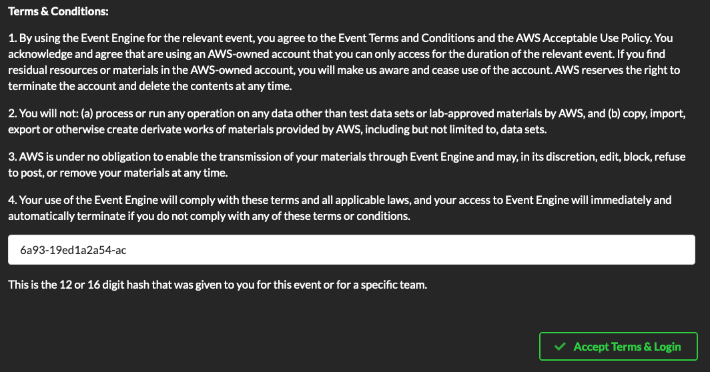

3. Select **Sign In with your social account**
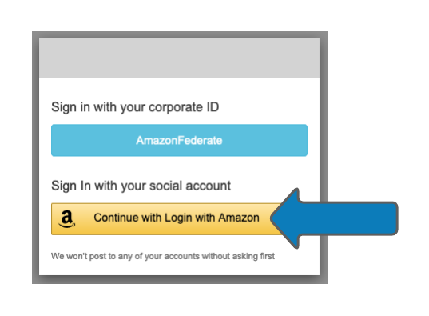

4. Enter your amazon.com credentials. These credentials are only used to identify you for this workshop.
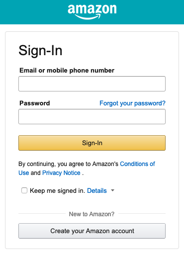

5. Once the event has started, the **Team Dashboard** will become available.
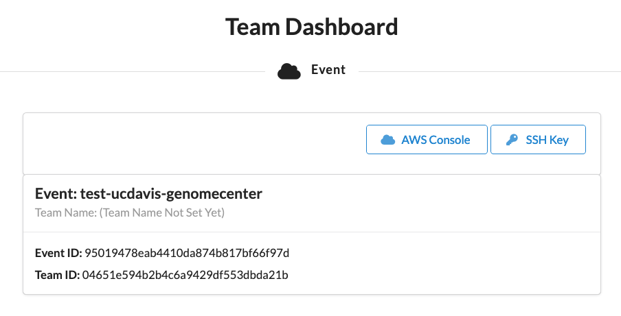

6. Click on **SSH Key**, then **Download Key**. Save this key somewhere safe.
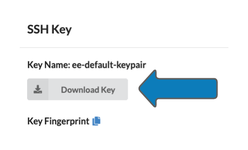

7. Click **OK** to close the window and then select **AWS Console** from the main Dashboard.
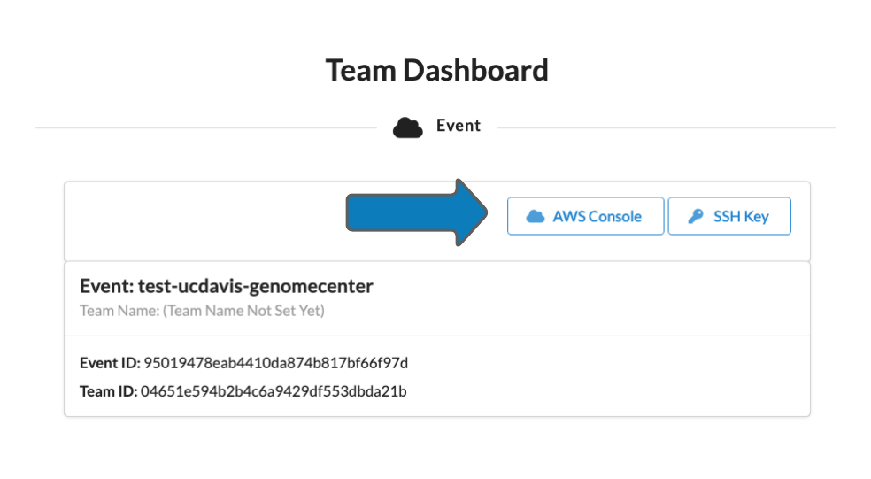

8. Click **Open AWS Console** to open the AWS Console
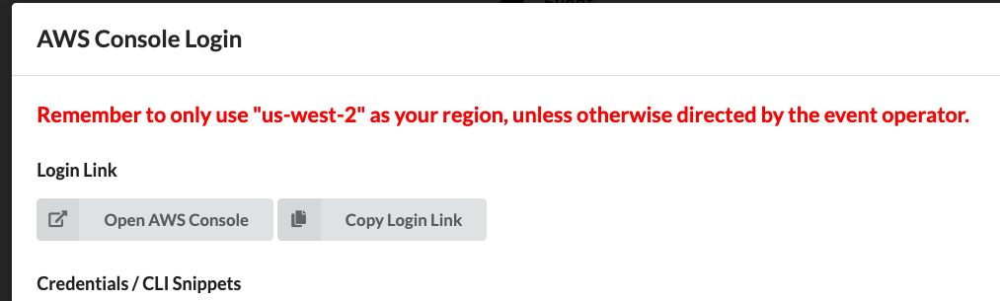

## Launch the CloudFormation Stack

### Instructions
1. Launch the AWS CloudFormation in your AWS account using the **Launch Stack** button above.
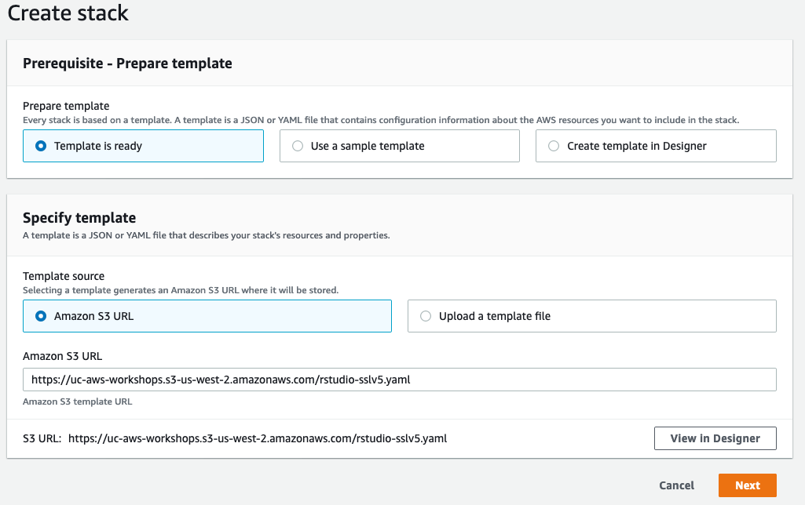
2. Click "Next"
3. Enter Parameters for the stack.
    - For the **KeyPair**, select "ee-default-keypair" from the dropdown
    - For the **UserList**, choose a username and password, and enter them in the format "username,password"
    - For the **VPCId** parameter, use your Default VPC (172.31.0.0/16)
    - For the **VPCSubnet** parameter, choose a subnet within the Default VPC (172.31.0.0/20)
    - Leave the other defaults alone.
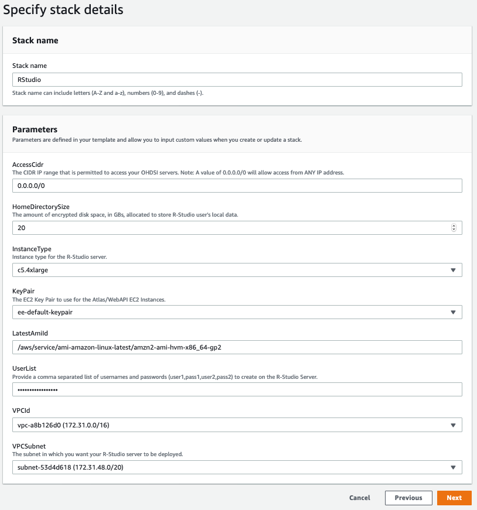

4. Click **Next**
5. Click **Next**
6. Acknowledge that AWS CloudFormation might create IAM resources, and click **Create Stack**
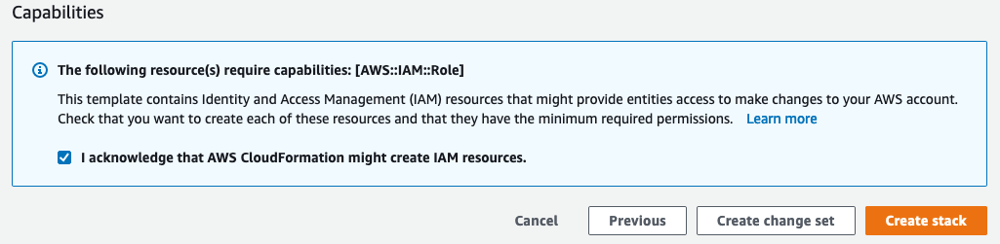

7. After 5 minutes, follow the link in the **Outputs** tab of your AWS CloudForamtion Stack to access RStudio.
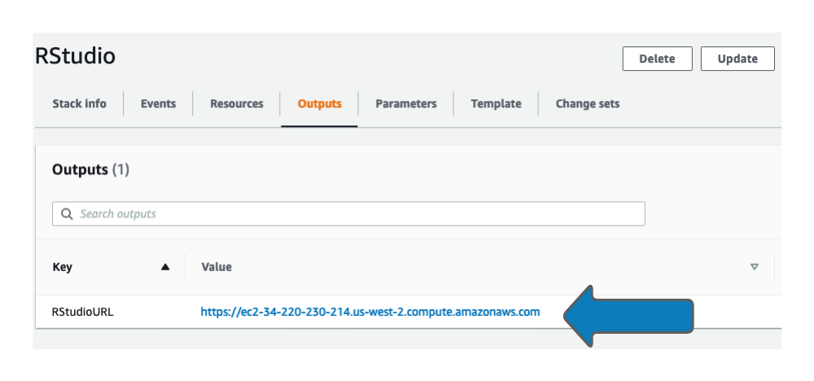

8. Accept the warning from your browser about the certificate being self-signed.  This gives us encrypted, HTTPS access to RStudio without purchasing a domain name or SSL certificate.

9. Login to RStudio using the credentials you provided to the AWS CloudFormation template.
!()[images/rstudio1.png]
