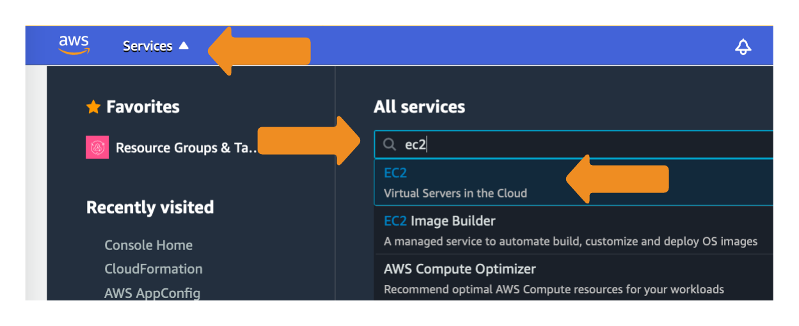
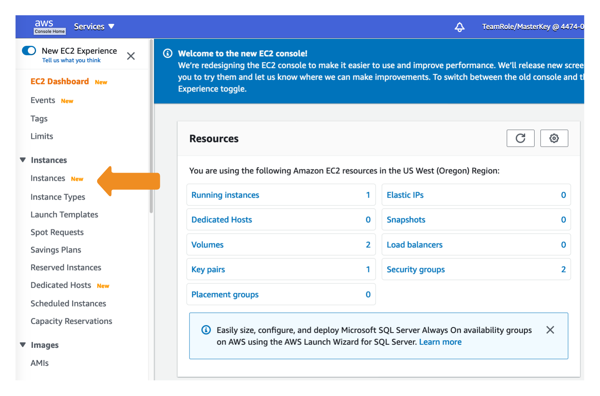
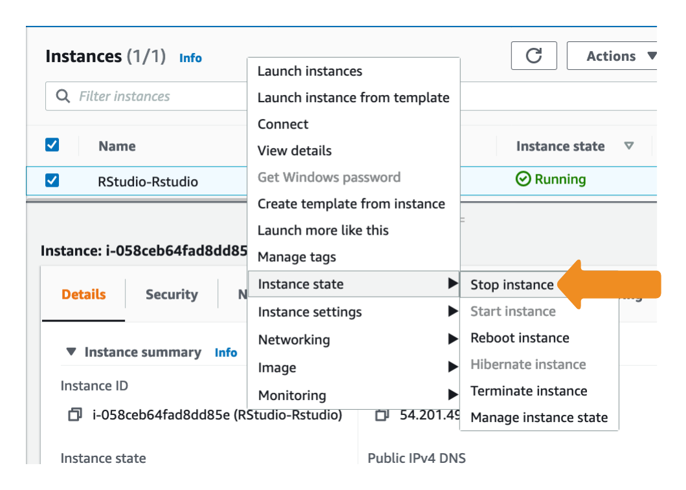
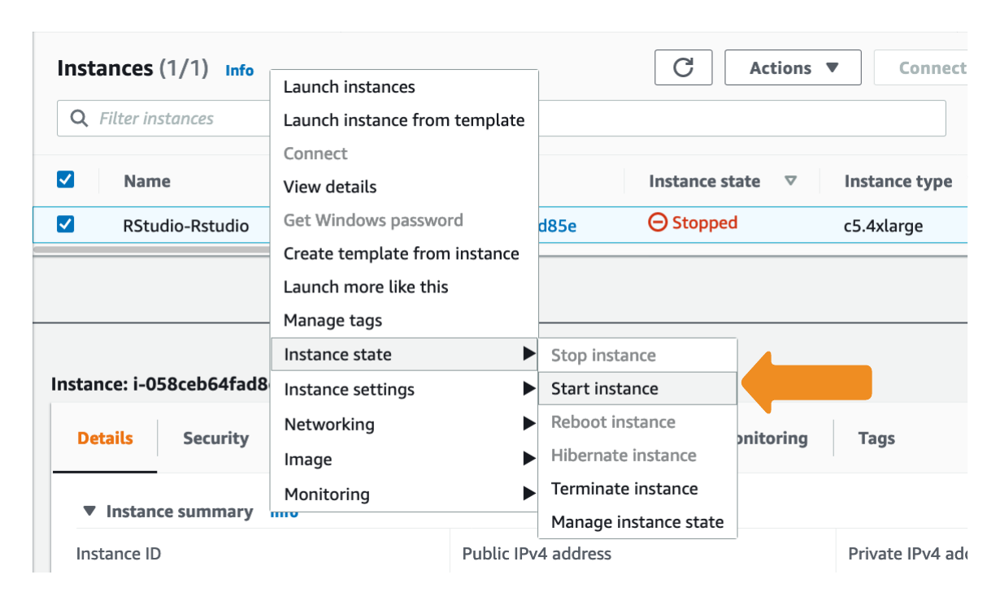
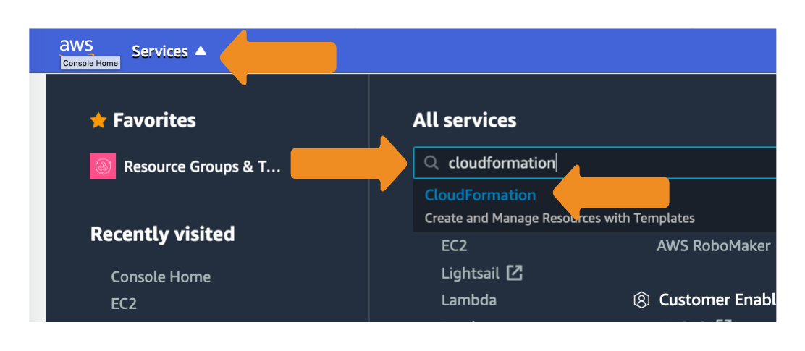
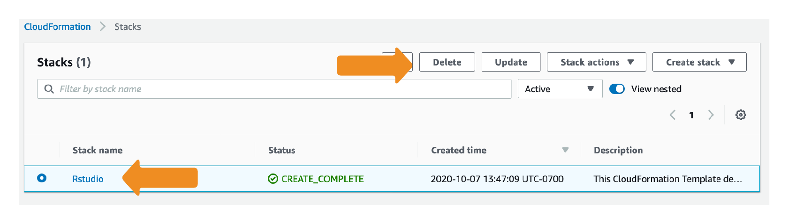
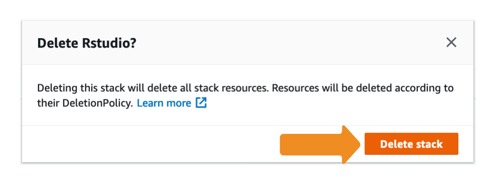

## Stop your EC2 instance.

1. Click on the **Services** dropdown in the upper left corner of the Console, and type **ec2**, and click on the **EC2** Service.

2. Click on **Instances**

3. Right click on your instance, select **Instance state**, then click on **Stop instance**

**Note:** This will shutdown your instance, and you are no longer paying for the EC2 virtual server. However, charges will still accrue for the storage associated with the instance.
To completely stop all charges, you can perminantly **Terminate** the instance or deleting the stack (see **To clean up your R environment by deleting the CloudFormation Stack**) below. Both of these processes will completely delete your instance, you will not be able to start it again.

## To Start your EC2 instances

1. Repeat steps 1 and 2 above to get to the **Instances** page.

2. Right click on your instance, select **Instance state**, then click on **Start instance**

## To clean up your R environment by deleting the CloudFormation Stack

**Note:** This process will completely delete your lab environment. If you are using AWS provided accounts, you do not need to do this, as AWS will automatically clean your account when the workshop completes.

1. Click on the **Services** dropdown in the upper left corner of the Console, and type **cloudformation**, and click on the **CloudFormation** Service.

2. Select the **Rstudio** stack, and click the **Delete** button.

3. Click **Delete**

The stack will take a couple of minutes to delete. The Status will change from **DELETE_IN_PROGRESS** to **DELETED** when the process is complete. 
